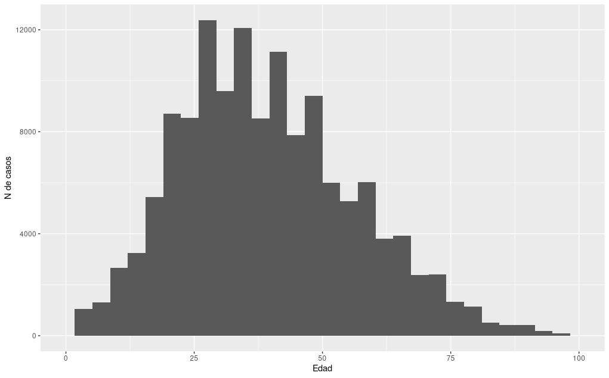
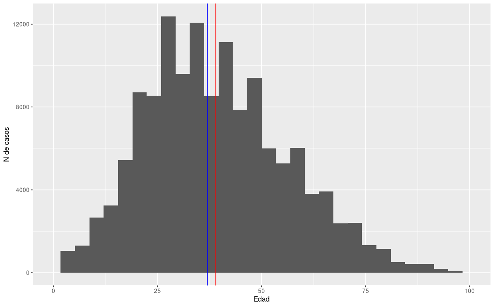

# Media vs Mediana y COVID-19

Vamos a comparar la media (o promedio) con la mediana para la población de CABA que dio positivo el test de COVID durante el mes de abril de 2021.

Los datos crudos pueden ser accedidos en el siguiente link:

https://data.buenosaires.gob.ar/dataset/casos-covid-19/archivo/df05ae09-975f-40fc-9011-c5ccff0024ab

Primero filtramos los datos para quedarnos sólo con la población que dio positivo el test durante el mes de abril.

Luego podemos hacer un histograma para tener un idea de cómo se distribuyen los datos.

Ahora podemos calcular los estadísticos de resumen para la población. En la tabla hay mucha info, nosotros nos centraremos sólo en la variable edad.

Hay 136422 pacientes que dieron positivo durante abril en CABA.

La media es de 39 años y la mediana es de 37 años.

Aunque el valor que separa la mitad más baja de la distribución de la más alta es estrictamente la mediana, puede verse que para describir la distribución etárea usar la media no es una mala aproximación en absoluto.

Podemos calcular cuántos valores hay por encima de la media y cuántos por debajo.

Hay 62337 datos mayores que 39 y 71252 datos inferiores.

Si dijéramos que la media parte los valores a la mitad estaríamos cometiendo un error menor al 10%.

Dada la distribución podemos asumir normalidad (pueden hacer un Q-Q plot para comprobar esto), entonces la media y la mediana deberían estar bastante cerca una de la otra. 

Para nuestro ejemplo:

 

En rojo está indicada la media (promedio) y en azul la mediana.

Para ver cómo se realizaron los cálculos puede acceder al script de R [aquí](analis-covid.R).

Para más info sobre medias y medianas
https://www.diffen.com/difference/Mean_vs_Median
